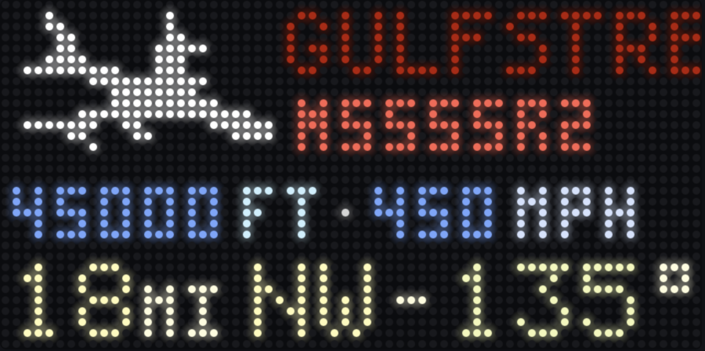

# FlightWall Layout

### UI Mockups
**Commercial**

**Non-Commercial**
 

**TODO:**
- make fail safe and make type(ref/val) qualifier decsions
- comment throughly for myself
- how to handle the different SBS message types 
- add option qualifier to optional fields
- use steady clock for time
- need exponential backoff for the try_sleep recv
- build out psuedo code
- slection needs to be thought out more. like I need to rank by closests by what about ties. also makes sure to only switch planes if the best plane is greater than a certain margin, and don't allow switches too quick. a plan should stay on the board for a certain amount of time always.
- what to show when there is not nearby aircraft
- create a config to hold data like current location and matrix settings. possiblity have it find my location for me.
- patch file for clipping logic
- build out the render thread main loop with double buffering 

## Intro 1: Thread safety

### Thread Safe Snapshot

``` C++
class Snapshot {
private:
    Aircraft _a;
    mutable std::mutex _mtx;

public:

    void write(Aircraft a){
        std::lock_guard<std::mutex> lock(_mtx);
        _a = std::move(a);
    }

    const Aircraft& read() const{
        std::lock_guard<std::mutex> lock(_mtx);
        return _a;
    }
};
```


### Thread Safe Queue

High Level:
Class implements the standard queue but adds mutex and condition variables. Each operation (pop or push) will aquire a mutex lock then operated on queue after scope ends mutex is unlocked. 

Implementation:

Check here for more detailed implementation:
[Reference](https://medium.com/@abhishek.kr121/thread-safe-queue-implementation-c3d63c1c6d7f)

Includes:

``` c++
#include <queue>
#include <mutex>
#include <condition_variable>
```

``` c++
template <typename T> // Class works with any type
class TSQueue {
private:
    std::queue<T> _q; // queue for any element
    mutable std::mutex _mtx; // lock access to queue / Why mutable? -> because idk i forgo im toired
    std::condition_variable_any _cv; // Signal to other thread

public:
    TSQueue(const TSQueue&) = delete; // Remove copy costructor
    TSQueue& operator=(const TSQueue&) = delete; // Remove copy assignment operator

    void push(const T& val) { // pass reference to not copy but make const so this function can't change shi
        {
            std::lock_guard<std::mutex> lock(_mtx); // lock mutex (lock guard releases at end of scope)
            _q.push(val);
        } // end mutex scope
        _cv.notify_one(); // Notiy one of waiting thread 
    }

    std::optional<T> pop(std::stop_token st){
        std::unique_lock<std::mutex> lock(_mtx); // unique lock for pop b/c wait needs to unlock and relock the mutex while thread sleeps
  
        _cv.wait(lock, st, [this] { return !_q.empty(); });

        if (_q.empty()) return std::nullopt;

        T t = std::move(_q.front()); // Retrieve first in line then move ownership
        _q.pop();
        return t;
    }

    std::optional<T> pop_until(std::stop_token st, std::chrono::time_point deadline){
        std::unique_lock<std::mutex> lock(_mtx);
        _cv.wait_until(lock, st, deadline, [this] { return !q.empty(); });

        if (_q.empty()) return std::nullopt;
        
        T t = std::move(_q.front());
        _q.pop();
        return t;
    }

    std::optional<T> try_pop(){
        std::lock_guard<std::mutex> lock(_mtx);
        if (q.empty()) return std::nullopt;

        T t = std::move(_q.front());

        _q.pop();
        return t;
    }
    
    bool empty(){
        std::lock_guard<std::mutex> lock(_mtx);
        return _q.empty();
    }
    // empty()
    // size()
}
```


## Intro 2: Makefiles


## Intro 3: Proposed architecture

Principles:
1. Every loop either runs forever or is cancelled cooperatively
2. Each time there is a handoff of data between threads we must use a thread safe primiative (Snapshot and TSQueue)
3. When things go wrong do not fail, degrade or pass
4. Anything that is blocking(recv, pop, GET) must be able to be woken by stop request
```
Socket Reader (Thread 1)
    - Aquires mutex
    - Pushes to Queue
    - Notifies other thread
    - Stale Handle: When queue is full remove oldest

Raw message Queue 

Main (Thread 2).                            -->  Enrich Queue  -->  Enrich (Thread 3)
    On every message (q.pop()):                                       - pop from queue
    - pop message from queue.                                         - call api
    - parse msg, update plane               <--  Result Queue         - enrich aircraft object               
    - if new plane push to enrich queue                               - push to queue

Snapshot

Renderer (Thread 5)
    - Builds canvas
    - Draws to matrix
```

## 1: Read ADSB Messages from Socket

Input: Byte streams
Output: std::vector<std::string> of individual ADSB messages

High Level:

Client socket connection to dump1090 server
- Use POSIX getaddrinfo() to retrieve identity of host and service
- Look up is done using host name, port number, address type, and address family
- Init addrinfo struct and pass address to hold returned linked list
- Call socket() sys call socket object with family (internet), type (stream), and protocol (TCP)
    - Here we just use the fields pulled by getaddrinfo in addrinfo struct
    - We use internet becasue dump1090 sends TCP data over socket at port 3003 
- Call conect() sys call using the socketfd, address, address len

Buffering byte stream and dividing bytes into messages
- Use std string (to use .substring method) to hold buffer
- User char[] for chunk at standard 4096 size
- Start outer loop to read bytes into chunck from socket using recv and append chunk to buffer
- Break out if ssize_t byte number is negative (connection lost or error)
- inner loop to seperate buffer by delimiter (using find to find position and substr to save new message)
- erase from buffer 0 to delimter
- handle new message (add to queue)

Thread safety:

Producer Thread -> Queue --> Consumer Thread

Implementation:

Includes:

<cstdio> : perror, etc.
<cstdlib> : exit
<string> / <vector> : own and return the parsed messages
<sys/types.h> : data types for sys calls
<sys/socket.h> : structures needed for sockets
<netdb.h> : getaddrinfo + addrinfo 

Structs:

``` C++
struct addrinfo // resolver fills a linked list of these; protocol-agnostic (IPv4/IPv6)
{
  int              ai_flags;     // AI_PASSIVE, AI_CANONNAME, ...
  int              ai_family;    // AF_INET, AF_INET6, AF_UNSPEC
  int              ai_socktype;  // SOCK_STREAM for the ADSB TCP feed
  int              ai_protocol;  // 0 = any
  socklen_t        ai_addrlen;   // length of ai_addr
  struct sockaddr *ai_addr;      // ready-to-use binary address (pass straight to connect, old version had to convert yourself)
  char            *ai_canonname; // canonical host name
  struct addrinfo *ai_next;      // next candidate address, or nullptr
};
```

Helpers:

``` C++
int conn_sock(const char* host, const char* port){
    // ADSB feed port, as a service string for getaddrinfo

    // Hints to resolver what kind of address is needed
    struct addrinfo hints{};         // value-init to all zero
    hints.ai_family   = AF_UNSPEC;   // IPv4 or IPv6
    hints.ai_socktype = SOCK_STREAM; // TCP

    struct addrinfo *res = nullptr;  // resolver outputs linked list (free with freeaddrinfo)
    if (getaddrinfo(host, port, &hints, &res) != 0) // 0 if success
        return -1; 

    int fd = -1;
    for (addrinfo* p = res; p != nullptr; p = p->ai_next){
        fd = socket(p->ai_family, p->ai_socktype, p->ai_protocol); // AF_INET or AF_INET6 (Internet), STREAM, TCP
        if (fd < 0)
            continue; // Try next
        
        if (set_timeout(fd)
            && connect(fd, p->ai_addr, p->ai_addrlen) == 0) // fd, binary address, length
            break;

        close(fd); 
        fd = -1;
    }

    freeaddrinfo(res); // Free linked list
    return fd;
}

bool set_timeout(int fd){
    timeval t{};
    t.tv_sec = 1; // Seconds
    t.tv_usec = 0; // Microseconds

    return setsockopt(fd,SOL_SOCKET, SO_RCVTIMEO,&t, sizeof(t)) == 0;
}
```

``` C++

// This closes the fd upon return
void recv_sock(int fd, TSQueue &q, std::stop_token st){
    std::string buffer;
    char chunk[4096]; // common chunk size

    // Outer loop to read chunk message and add to buffer
    while (!st.stop_requested())
    {
        ssize_t n = recv(fd, chunk, sizeof(chunk), 0); // receive bytes from socket and save into   chuck with default behavior (flags = 0)

        if (n == 0)
            break; // connection closed

        if (n < 0){
            if (errno == EAGAIN || errno == EWOULDBLOCK) // Timeout try agin (need so that stop request check can be reached) 
                continue;

            break;
        }

        buffer.append(chunk, n); // Add chunk of message to buffer

        size_t pos;
        // Inner loop to divide buffer into messages using delimeter
        while ((pos = buffer.find("\r\n")) != std::string::npos) // npos means not found
        {
            std::string msg = buffer.substr(0, pos); // Save message

            buffer.erase(0, pos + 2); // 2 for both \r and \n
            // Handle msg
            q.push(msg);
        }
    }

    close(fd);
}

```

``` c++

void socket_reader(std::stop_token st, TSQueue &q){
    const char *host = "localhost";
    const char *port = "30003";
    int fd;
    std::chrono<milliseconds> time

    while (!st.stop_requested()){
        fd = conn_sock(host, port);

        if (fd < 0) {
            if !try_sleep(st, time) // Check if sleep interupted by stop request
                break;
            
            continue;
        }

        recv_sock(fd, q, st);
    }
}

// Sleep returns true if wait was not interupted by stop
bool try_sleep(std::stop_token st,  std::chrono::milliseconds time){
    // Mutex here is not meaningful, as in, it does not protected any shared data
    // The only reason it is here is use the wait_until function which follows
    // Condition variable semantics. THe only meaningful parts is the stoptoken
    // and the time which wait until will use to stop waiting if the time is up
    // of the stop token received a stop request
    std::mutex mtx; 
    std::condition_variable_any cv; // any is need because it expose wait until api with stop_token
                                    // Regulare condition variable doesn't have it.
    std::unique_lock<std::mutex> lock(mtx); // not meaningfull

    cv.wait_until(lock, st, time, [] { return false; }) // Predicate not meaningful

    if (st.stop_requested()) 
        return false;

    return true;
}
```

## 2: Main Aircraft Processing

[reference]("http://woodair.net/sbs/article/barebones42_socket_data.htm")

Aircraft Stuct:
``` C++
struct Aircraft {
    enum class Operation {
        Com,
        Non
    }
    enum class Type {
        Prop,
        Jet,
        Heli,
    }

    bool enriched;

    // SBS Data - Required
    std::string icao; // Field 4 - all messages

    // SBS Data - Optional
    std::string callsign; // Field 11 - MSG 1
    int alt; // Field 12 - MSG 2,3,5,6,7 
    int gs; // Field 13 - MSG 2,4
    int trk; // Field 14 - MSG 2,4
    double lat; // Field 15 - MSG 2,3
    double lon; // Field 16 - MSG 2,3
    bool gnd; // Field 22 - MSG 2,3,5,6,7,8

    // API Data - Optional
    bool has_logo;
    std::string airline;
    std::string flight_no;
    std::string type_code;
    Operation op;
    Type type;

    // Derived Data - Optional
    double distance;
    std::chrono::steady_clock::time_point last_seen;

    // Constructor that takes in just the IACO and defaults the other fields
    Aircraft(std::string iaco) : iaco(iaco) }{};

    // Method to update fields from on msg string
    void update(std::vector<std::string> msg) {
        last_seen = std::chrono::steady_clock::now();

        switch (std::stoi(msg[1])){ // MSG type
            case 1:
                callsign = msg[10];
                break;
            case 2:
                alt = std::stoi(msg[11]);
                gs = std::stoi(msg[12]);
                trk = std::stoi(msg[13]);
                lat = std::stod(msg[14]);
                lon = std::stod(msg[15]);
                gnd  = std::stoi(msg[21]);
                distance = calc_distance(lat, lon);
                break;
            case 3:
                alt = std::stoi(msg[11]);
                lat = std::stod(msg[14]);
                lon = std::stod(msg[15]);
                gnd  = std::stoi(msg[21]);
                distance = calc_distance(lat, lon);
                break;
            case 4:
                gs = std::stoi(msg[12]);
                trk = std::stoi(msg[13]);
                break;
            case 5:
                alt = std::stoi(msg[11]);
                gnd  = std::stoi(msg[21]);
                break;
            case 6:
                alt = std::stoi(msg[11]);
                gnd  = std::stoi(msg[21]);
                break;
            case 7:
                alt = std::stoi(msg[11]);
                gnd  = std::stoi(msg[21]);
                break;
            case 8:
                gnd  = std::stoi(msg[21]);
                break;
        }
    }
    // Method to enrich from enrich json
};

double calc_distance(double lat, double lon) {
    // TODO: write logic
}

void process(std::stop_token st, 
             TSQueue& msg_q, 
             TSQueue& enrich_q, 
             TSQueue result_q, 
             Snapshot snapshot){
    std::map<std::string, Aircraft> aircrafts;
    auto deadline = std::chrono::steady_clock::now() + 30s;

    while (!st.stop_requested()){
        std::optional<std::string> msg = msg_q.pop_until(st /*, deadline */);
        if (st.stop_requested()) return;

        // Process message
        if (msg) {
            std::vector<std::string> fields = split(msg, ",");
            std::string iaco = fields[1];
            auto [it, inserted] = aircrafts.try_emplace(icao, icao);
            
            it->second.update(fields);


            if (!it->second.enriched 
                && !it->second.callsign.empty())
                enrich_q.push(Request{it->second.icao, it->second.callsign});
        }

        // Maintenance
        auto now = std::chrono::steady_clock::now();
        if (now >= deadline) {

            // Enrich
            while (!result_q.empty()){
                auto response = result_q.try_pop();
                if (!response) continue;

                auto a aircrafts.find(response.icao); // TODO: Make response struct
                if (a == aircrafts.end()) continue;

                a->enrich(response.data) // TODO: Make response struct and enrich method
            }

            // Clean stale aircraft
            for (auto it = airacrafts.begin; it != aircrafts.end();){
                if (now - it->second.last_update >= 60s)
                    it = aircrafts.erase(it);
                else
                    ++it;
            }

            if (aircrafts.empty()) return;

            // Select featured aircraft
            Aircraft* featured = &(aircrafts.begin()->second);
            int closest = featured.distance;
            for (auto& [icao, a] : aircrafts){
                if (a.distance < closest)
                    closest = a.distance;
                    featured = &a;
            }
            snapshot.write(*a);
        }
    }
}


```

Main Psudeo Code:
``` psuedo
lastUpdate

while true:
    msg = parse(messageQueue.pop())
    aircraft = aircrafts.find(msg.iaco)

    if (!aircraft)
        new = Aircraft(msg)
        aircrafts.add(new)
        enrichQueue.push([new.iaco, new.callsign])
        continue

    aircraft.update(msg)

    // Maintenance
    if time.now - lastUpdate >= 30:

        // Update planes with result queue
        for response in responses:
            aircraft = aircrafts.find(response.iaco)
            aircraft.enrich(response)
            
        // Clean stale planes
        for aircraft in aircrafts:
            if time.now - aircraft.lastSeen >= 60:
                aircrafts.remove(aircraft.iaco)
    
        feature = select(aircrafts)
        snapshot.write(feature)
```

## 4: Enriching

Source: [adsbd.com]("https://www.adsbdb.com/")

API Call: `https://api.adsbdb.com/v0/aircraft/{ MODE_S || REGISTRATION }?callsign={ CALLSIGN_ICAO || CALLSIGN_ICAO }`
- MODE_S = icao
- CALLSIGN_ICAO = callsign

Highlevel:
Api I calls are slow and prone to issues. We issolate this execution from main thread to prevent main executions from being blocked. Below I list some considertations for making robust API calls:

Response (Relevant fields only):
``` json
{
    "response": {
        "aircraft": {
            "manufacturer": "Cirrus", // Needed for non-commercial UI only
        },
        "flightroute": {
            "callsign_iata": "FR1054",
            "airline": {
                "name": "Ryanair"
            },

            // Might use lat/lon for path UI
            "origin": { 
                "iata_code": "EDI",
                "latitude": 55.950145, 
                "longitude": -3.372288,
            },
            "destination": {
                "iata_code": "PRG",
                "latitude": 50.1008,
                "longitude": 14.26,
            }
        }
    }
}
```

``` c++
void enrich(std::stop_token st, TSQueue enrich_q, TSQueue result_q){
    while (!st.stop_requested){
        auto req = enrich_q.pop(st); // Blocking ok I thinks
        std::string url = std::format("https://api.adsbdb.com/v0/aircraft/{}?callsign={}", req.icao, req.callsign);

    }
}
```

Psuedo Code:
``` psuedo
base = "https://api.adsbdb.com/v0/aircraft/"
while true:
    req = enrichQueue.pop()
    url = base + req(0) + "?callsign=" + req(1)
    response = get(url)
    json = parse(response.text)
    // Add logic to retrieve logo
    resultQueue.push(json)
```

## 5: Renderer

High Level:

I created the concept of an element as another layer of abstraction on top of text. The reason was to be able to apply fiting rules to associated text ( In fit mode A telemetry value cannot be draw without its unit). These fitting rules are apply at the caller level.

### Model to UI:

``` c++

const rgb_matrix::Color RED(227, 36, 0);
const rgb_matrix::Color LIGHT_RED(255, 140, 130);
const rgb_matrix::Color ORANGE(217, 80, 0);
const rgb_matrix::Color YELLOW(255, 251, 185);
const rgb_matrix::Color LIGHT_YELLOW(254, 252, 221);
const rgb_matrix::Color GREEN(119, 187, 65);
const rgb_matrix::Color BLUE(116, 167, 254);
const rgb_matrix::Color LIGHT_BLUE(212, 227, 254);

const rgb_matrix::Color WHITE(235, 235, 235);
const rgb_matrix::Color GREY(214, 214, 214);
const rgb_matrix::Color BEIGE(255, 242, 213);


struct Row {
    std::vector<Element> items;
    int space;
    Mode mode;
}

struct Element {
    vector<Text> items;
    int space;
    Mode mode;
};

struct Text {
    const std::string items;
    const Font& font;
    const Color& color;
}

enum class Mode {
    clip,
    fit,
    scroll
};

enum class Theme {
    Com,
    Non
};

struct AircraftDisplay {
    magick::image logo;
    std::vector<Row> rows;
    Rect content;

    AircraftDisplay(const Aircraft& a, const Theme& t,
                    const Font sml, const Font med, const Font lrg) {
        
        switch (t) {
            case Theme::Com:
                rows.push_back(Row{{Element{Mode::Scroll, 0, {Text{a.airline, lrg, RED}}}}, 0});
                rows.push_back(Row{{Element{Mode::Fit, 0, {Text{a.flt_no, sml, LIGHT_RED}}},
                                    Element{Mode::Fit, 0, {Text{"·", sml, GREY},
                                                              Text{a.typ_code, sml, LIGHT_RED}}}}, 2});
                break;

            case Theme::Non:
                rows.push_back(Row{{Element{Mode::Scroll, 0, {Text{a.callsign, lrg, RED}}}}, 0});
                rows.push_back(Row{{Element{Mode::Fit, 0, {Text{a.flt_no, sml, LIGHT_RED}}}}, 0});
                break;
        }

        rows.push_back(Row{{Element{Mode::Fit, 2, {Text{a.speed, sml, BLUE},
                                                      Text{"mph", sml, LIGHT_BLUE}}},
                            Element{Mode::Fit, 2, {Text{a.alt, sml, BLUE},
                                                      Text{"ft", sml, LIGHT_BLUE}}}}, 2});
        
        switch (t) {
            case Theme::Com:
                rows.push_back(Row{{Element{Mode::Fit, 0, {Text{a.orgn, med, LIGHT_RED}}},
                                    Element{Mode::Fit, 0, {Text{"→", med, BEIGE}}},
                                    Element{Mode::Fit, 0, {Text{a.dest, med, GREEN}}}}, 2});
                break;
            case Theme::Non:
                rows.push_back(Row{{Element{Mode::Fit, 2, {Text{a.dist, med, YELLOW},
                                                              Text{"mi", sml, LIGHT_YELLOW}}},
                                    Element{Mode::Fit, 0, {Text{a.brg, med, YELLOW}}},
                                    Element{Mode::Fit, 2, {Text{"-", med, YELLOW},
                                                              Text{a.trk, med, YELLOW},
                                                              Text{"°", sml, LIGHT_YELLOW}}}}, 2});
                break;
        }
    }
}

struct Position {
    Text text;
    int x;
    int y;
    int l;
    int r;
}

std::vector<positions> layout(const AircraftDisplay& disp, int64_t time){
    const int y1 = disp.logo.rows(); // Anchor to bottom line of logo
    const int y2 = y1 + disp.rows[2].h + disp.row_gap;
    const int y4 = disp.content.btm(); // Anchor to bottom of frame
    const int y3 = y4 + disp.rows[4].h + disp.row_gap; 

    int x = disp.frame.left();
    const int x1 = (1 <= disp.logo_span) ? x + img : x;
    const int x2 = (2 <= disp.logo_span) ? x + img : x;
    const int x3 = (3 <= disp.logo_span) ? x + img : x;
    const int x4 = (4 <= disp.logo_span) ? x + img : x;

    vector<positions> pos;
    pos.push_back(lay_row(disp.rows[1], x1, y1));
    pos.push_back(lay_row(disp.rows[2], x2, y2));
    pos.push_back(lay_row(disp.rows[3], x3, y3));
    pos.push_back(lay_row(disp.rows[4], x4, y4));

    return pos;
}

std::vector<positions> lay_row(int x, int y, int r,
                               const Row& row, 
                               std::optional<int64_t> time){
    std::vector<Positions> pos;
    int start = x;

    for (size_t i = 0; i < row.elements.size(); i++){
        int w;=
        elmnt = row.elements[i];
        std::vector<Postion> np = lay_elmnt(x, y, &w, row.gap, elmnt);

        if (x + w  > r) {
            switch (row.mode) {
                case Mode::Fit:
                    return pos;
                
                case Mode::clip;
                    pos.push_back(np);
                    return pos;

                case Mode::scroll;
                    std::vector<Element> rest(row.elements.begin() + i, row.elements.end());
                    pos.push_back(np);
                    x = scroll_placement(start, x, Row{rest, row.gap, row.mode});
                    pos.push_back(lay_elmnt(x, y, &w, row.gap, elmnt));
                    x += w;
                    continue;
            }
        }

        pos.push_back(np);
        x += w;
    }
}

int scrl_plcmnt(int strt, int l, int r, 
                int scrl_gap, int pps,
                int64_t time, 
                const Row& rest) {
    
    int scrl_ofst = time * (pps / 1000) % (r - l)
    strt += scrl_ofst;
    int w = msr_row(rest);
    int r = start + w - r;
    int offset = w - leftover;
    int max_x = start - w - scrl_gap;

    if ( l < max_x)
        return l - offset;
    
    return max_x - offset;
}

int msr(const std::string& text){
    return MeasureText(text.c_str());
}

template <typename T>
int msr(const T& t){
    int w = 0;
    const size_t n = t.items.size();
    for (size_t i = 0; i < n; i++){
        w += msr(t.items[i]);
        if (i + 1 < t.items.size())
            w += t.gap;
    }
    return w;
}

std::vector<Position> lay_elmnt(int x, int y, int& w,  int gap,
                                 Element& elmnt) {
    int start = x;
    std::vector<Position> pos
    for (size_t i = 0; i < elmnt.items.size(); i++) {
        Text itm = elmnt.items[i];
        Position np{itm, x, y};
    
        x += MeasureText(itm.value, itm.font);
        if (i < elmnt.items.size() - 1)
            x += gap;

        pos.push_back(np);
    }
    w = x - start;
}

```

### UI Layer:
Classes:
``` c++
// Likely needed, highly intuitive
class Rect {
    public:
        int x;
        int y;
        int h;
        int w;

        Rect(int x, int y, int h, int w):
            x(x), y(y), h(h), w(w) {}

        void inset(int padding){
            x += padding;
            y += padding;
            h -= padding * 2;
            w -= padding * 2;
        }

        int lft() { return x; }
        int rght() { return x + w; }
        int tp() { return y; }
        int btm() { return y - h; }
};

void draw(const std::vector<Placement>& positions, Canvas *c){
    for (const auto& pos : positions)
        DrawText(c, pos.text.font,
                 pos.x, pos.y, 
                 pos.text.val.c_str(),
                 pos.l, pos.r);
}   
```

``` c++
// From image-example.cc
void draw_image(Canvas *c, int x, int y, const Magick::Image &image) {
    for (size_t y = 0; y < image.rows(); ++y) {
    for (size_t x = 0; x < image.columns(); ++x) {
      const Magick::Color &c = image.pixelColor(x, y);
      if (c.alphaQuantum() < 256) {
        canvas->SetPixel(x + offset_x, y + offset_y,
                         ScaleQuantumToChar(c.redQuantum()),
                         ScaleQuantumToChar(c.greenQuantum()),
                         ScaleQuantumToChar(c.blueQuantum()));
      }
    }
  }
}

static Magick::Image load_image(const std::string& path){
    Magick::Image image(path);
    image.scale(Magick::Geometry("x14")); // Scale height to 14px, auto width
    return image;
}
```

Hzeller Library Edit:
``` c++
// In bdf-font.cc

// Skip drawing pixels outside of clip bounds
int Font::DrawGlyph(Canvas *c, int x_pos, int y_pos,
                    const Color &color, const Color *bgcolor,
                    uint32_t unicode_codepoint,
                    int l_clip, int r_clip) const {
  const Glyph *g = FindGlyph(unicode_codepoint);
  if (g == NULL) g = FindGlyph(kUnicodeReplacementCodepoint);
  if (g == NULL) return 0;
  y_pos = y_pos - g->height - g->y_offset;

  if (x_pos + g->device_width < 0 || x_pos > c->width() ||
      y_pos + g->height < 0 || y_pos > c->height() ||
      x_pos + g->device_width <= l_clip || x_pos >= r_clip) {
    return g->device_width;
  }

  for (int y = 0; y < g->height; ++y) {
    const rowbitmap_t& row = g->bitmap[y];
    for (int x = 0; x < g->device_width; ++x) {
      const int sx = x_pos + x;
      if (sx < l_clip || sx >= r_clip)
        continue;
      if (row.test(kMaxFontWidth - 1 - x)) {
        c->SetPixel(sx, y_pos + y, color.r, color.g, color.b);
      } else if (bgcolor) {
        c->SetPixel(sx, y_pos + y, bgcolor->r, bgcolor->g, bgcolor->b);
      }
    }
  }
  return g->device_width;
}

// Pass down clip parameters
int DrawText(Canvas *c, const Font &font,
             int x, int y, const Color &color, const Color *background_color,
             const char *utf8_text, int extra_spacing,
             int l_clip = INT_MIN, int r_clip = INT_MAX) {
  const int start_x = x;
  while (*utf8_text) {
    const uint32_t cp = utf8_next_codepoint(utf8_text);
    x += font.DrawGlyph(c, x, y, color, background_color, cp, l_clip, r_clip);
    x += extra_spacing;
  }
  return x - start_x;
}
```


``` c++

void render(std::stop_token st, Snapshot snap){
    // TODO: add checks for success and add font path
    rgb_matrix::Font sml = font.LoadFont(""); 
    rgb_matrix::Font med = font.LoadFont(""); 
    rgb_matrix::Font lrg = font.LoadFont(""); 

    auto start = std::chrono::steady_clock::now();
    while (!st.stop_requested){
        auto a = snap.read(); // TODO: Make this blocking
        if (st.stop_requested) return; 
        Theme t = (a.type == Type::Com) ? Theme::Comm : Theme::Non;
        AircraftDisplay disp{a, t, sml, med, lrg};

        auto elapsed = std::chrono::duration_cast<std::chrono::millisecongs>(std::chrono::steady_clock::now() - start).count();
        std::vector<Position> pos = layout(disp, elapsed);
        // TODO: Finish render logic
    }
}
```

Main:
``` Psuedo
// setup canvas
logo_cache:

last;
while true:
    plane = snapshot.read()
    
```

## 6: Entry

``` c++
int main(){
    sigset_t s;
    sigemptyset(&s);
    sigaddset(&s, SIGINT);
    sigaddset(&s, SIGTERM);
    pthread_sigmask(SIG_BLOCK, &s, nullptr);

    std::vector<std::jthread> threads;

    std::stop_source stp_src;
    threads.emplace_back(socket_reader, stp_src.get_token());
    threads.emplace_back(proccess, stp_src.get_token());
    threads.emplace_back(enrich, stp_src.get_token());
    threads.emplace_back(render, stp_src.get_token());

    int sig;
    sigwait(&s, &sig);

    stp_src.request_stop();
}

```

